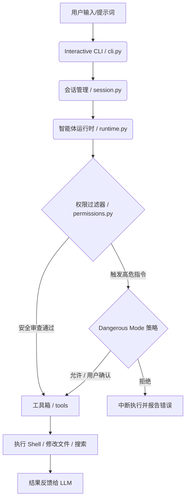

# 🚀 ForgeCode

<p align="center">
  <a href="https://github.com/BlueX888/forge-code">
    
  </a>
  <a href="LICENSE">
    
  </a>
  <a href="https://github.com/BlueX888/forge-code">
    
  </a>
  <a href="https://github.com/BlueX888/forge-code">
    
  </a>
</p>

**ForgeCode** 是一款专为现代开发者打造的本地化、高安全、强可控的 **AI 自动编码智能体 (AI Coding Agent)**。它直接运行在您的本地终端，深度对接 OpenAI 与 Anthropic 等一流大语言模型，具备自主分析项目结构、快速搜索代码、安全修改文件以及精准执行终端命令的强大能力。

与其他容易“野蛮生长”、甚至执行高危删除的自治型 AI 智能体不同，ForgeCode 始终将**绝对的控制权**交还给开发者。通过精心设计的**细粒度沙箱过滤机制**与**智能命令审查安全系统**，我们在不牺牲 AI 开发效率的前提下，为您的本地开发安全保驾护航。

---

## ✨ 核心特性

* 🛡️ **三级执行安全策略 (Dangerous Mode)**：
  * `deny`：完全禁止一切写文件和执行终端命令等高危操作。
  * `ask` (**默认**)：在执行任何危险命令或修改文件前，显式请求您的确认，并详细提示潜在影响。
  * `allow`：开启全自主运行模式，适合可信的开发场景。
* 🖥️ **极致的交互式 CLI 体验**：基于 `prompt_toolkit` 构建，为您带来语法高亮、命令补全和丝滑的流式输出交互。
* 📝 **智能思维可视 (Reasoning / Thinking Showcase)**：原生支持高级大模型（如 Claude 或 DeepSeek 思考模型）的思维链（Reasoning Process）展示，通过终端优雅呈现思维深度，并支持控制 Token 预算。
* 🔒 **敏感情境隔离 (Sensitive Leak Prevention)**：
  * 自动剥离 Shell 执行环境中的敏感环境变量（如 API Key, Secret 等），防止命令执行过程意外泄露敏感凭证。
  * 默认忽略 `.env` 及其他配置文件，确保密钥安全。
* 💾 **会话持久化与恢复 (Session Persistence)**：支持随时保存与 `--resume` 恢复上一次的编码上下文，历史记录支持持久化查询与一键清理。
* 🔌 **灵活的多提供商兼容**：官方原生支持 `anthropic` (Claude) 与 `openai` (兼容 OpenAI 协议的所有服务商，如 DeepSeek、SiliconFlow、本地 Ollama 等)。

---

## 🛠️ 架构与工作流

ForgeCode 采用高度解耦的模块化架构，将感知、决策与执行逻辑清晰划分：



* **权限与策略机制 (`permissions.py` & `command_policy.py`)**：安全沙箱能够精准过滤和控制越界路径，防范 AI 脱离项目根目录的越权读写；命令安全策略可精准解析 shell 命令，阻断诸如破坏系统环境或全局删除的高危指令。
* **高精度增量多文件编辑 (`file_write.py`)**：AI 通过极其精准的“匹配-替换（Match-and-Replace）”快照修改代码，不仅大幅度节省 Token 成本，更完全杜绝了盲目重写整个文件导致的大段内容丢失。

---

## 📦 快速开始

### 1. 安装 ForgeCode

确保您的本地 Python 环境版本 $\ge 3.10$。

```bash
# 克隆仓库
git clone https://github.com/BlueX888/forge-code.git
cd forge-code

# 根据您常用的模型提供商选择性安装依赖：
pip install .[openai]      # 使用 OpenAI / DeepSeek 等
pip install .[anthropic]   # 使用 Claude 3.5 Sonnet 等

# 或者直接安装开发与全部依赖：
pip install -e .[dev,openai,anthropic]
```

### 2. 配置 API Key 与环境

您可以将 API Key 设置为环境变量，或者在项目根目录下通过配置文件进行持久化设置。

**使用 OpenAI / 兼容提供商 (例如 DeepSeek):**
```bash
export OPENAI_API_KEY="your-api-key"
export OPENAI_BASE_URL="https://api.deepseek.com" # 如需使用非官方节点
```

**使用 Anthropic (Claude):**
```bash
export ANTHROPIC_API_KEY="your-api-key"
```

### 3. 持久化配置文件 `.forgecode.toml`

您可以在项目根目录或全局根目录（`~/.forgecode/config.toml`）中创建配置文件，方便每次免参数启动。以下是一份推荐的配置模板：

```toml
[model]
name = "deepseek-chat"        # 模型名称
provider = "openai"           # openai 或 anthropic
api_key = "your-api-key"      # 亦可通过环境变量注入
base_url = "https://api.deepseek.com" # API 地址

[agent]
dangerous_mode = "ask"        # 安全策略: ask | deny | allow
max_history_messages = 50     # 历史消息的最大保存条数
max_output_tokens = 4096      # 单次输出最大 token
show_thinking = true          # 开启思考过程显示
thinking_budget = 8000        # 思考 token 预算限制
memory_enabled = true         # 启用项目记忆隔离存储
permitted_directories = []    # 允许额外读取的绝对路径列表

[commands]
safe = ["git status", "git diff", "pytest"] # 豁免安全确认的白名单命令
```

### 4. 运行智能体

在您的项目工作目录下直接启动 ForgeCode：

```bash
# 启动智能体，默认以当前目录运行并采取安全询问模式 (ask)
forge-code

# 如果您完全信任智能体，希望其全自主无阻碍地运行：
forge-code --allow-dangerous
```

---

## ⚙️ 命令行参数详解

运行 `forge-code --help` 可以查看所有支持的命令行参数：

### 核心参数

| 参数 | 缩写 | 默认值 | 说明 |
| :--- | :--- | :--- | :--- |
| `--working-dir` | `-d` | 当前目录 | 智能体操作的工作目录，建议在您想修改的项目根目录下运行 |
| `--dangerous-mode` | - | `ask` | 危险操作策略：`ask` (每次询问), `deny` (完全禁止), `allow` (全自动) |
| `--allow-dangerous` | - | - | 快速开启全自动无阻碍执行模式 (等同于 `--dangerous-mode allow`) |
| `--provider` | - | `openai` | API 提供商类型：支持 `openai` 或 `anthropic` |
| `--model` | - | 自动获取 | 目标模型名称，如 `claude-3-5-sonnet-20241022` 或 `deepseek-chat` |
| `--api-key` | - | - | 覆盖注入 API Key |
| `--base-url` | - | - | 覆盖注入 API 基础请求地址 |
| `--show-thinking` | - | `True` | 开启或关闭模型思考/推理链在终端的显示 (使用 `--no-show-thinking` 关闭) |
| `--thinking-budget`| - | `10000` | 限制大模型思考所能消耗的最大 Token 预算 |
| `--prompt-file` | - | - | 从特定文件读取 Prompt，执行单次运行任务后立即退出 |

### 💾 会话管理参数 (Session Persistence)

| 参数 | 默认值 | 说明 |
| :--- | :--- | :--- |
| `--session [ID]` | - | 开启新会话 (不填 ID) 或恢复指定 ID 的历史会话 |
| `--resume` | - | 自动恢复最近一次运行的会话 |
| `--list-sessions` | - | 列出所有本地保存的历史会话列表 |
| `--delete-session [ID]` | - | 删除指定的历史会话 |
| `--session-dir` | `session/` | 会话文件的本地保存目录（已默认加入 `.gitignore`） |

---

## 🛠️ 内置工具箱 (Built-in Tools)

ForgeCode 为智能体配备了丰富且受限的核心系统级工具：

| 工具名称 | 安全标签 (Safety Label) | 功能描述 | 核心安全限制 |
| :--- | :--- | :--- | :--- |
| `read_file` | `READONLY` | 读取指定文件的内容，支持偏移行数和行数限制 | 严禁跨越安全沙箱路径；文件超出 1MB 自动阻断 |
| `list_directory` | `READONLY` | 列出指定目录下的全部子目录与文件信息 | 严禁越过工作目录边界 |
| `write_file` | `DESTRUCTIVE` | 创建新文件或覆盖已有文件 | **Dangerous Mode 拦截**；禁止写入非文本格式的二进制文件 |
| `edit_file` | `DESTRUCTIVE` | 精准匹配文件局部文本块并予以原子替换 | **Dangerous Mode 拦截**；如未匹配到 `old_text`，主动返回预览帮助重试 |
| `search` | `READONLY` | 按 Glob 文件名模糊搜索或基于正则过滤文本内容 | 沙箱外路径阻断；大文件预过滤 |
| `run_command` | `CONCURRENT_SAFE` | 在工作目录下执行指定的 shell 终端命令 | **Dangerous Mode 拦截**；环境变量敏感词（API_KEY, PASSWORD等）强力脱敏过滤 |

---

## 🛡️ 安全承诺与最佳实践

AI 编码智能体具有极大提高生产力的潜力，但也包含运行未知 Shell 的系统级安全隐患。ForgeCode 为确保极致的安全，遵循以下底层设计原则：

1. **绝对隐私隔离**：敏感凭证和私钥文件（如 `.env`, `.local.toml`）已被写入默认 `.gitignore`。沙箱系统也从底层对文件读取路径进行强边界校验，禁止智能体跨越工作目录获取其他路径信息。
2. **安全使用建议**：
   * **强烈建议仅在 Git 项目中使用**：在执行智能体开发后，您可以直观地通过 `git status` 与 `git diff` 确认 AI 修改的所有代码。
   * **白名单友好**：您可以将 `git diff` 或 `pytest` 等完全无损的读指令加入到配置文件中的 `[commands].safe` 白名单中，让它们免去每次询问，保持流畅交互。
   * **保持 `ask` 模式**：除非在干净、已提交版本的独立容器环境内，我们强烈建议您默认开启 `--dangerous-mode ask`。

---

## 🤝 参与贡献

我们极其欢迎来自开源社区的任何形式的贡献！
如果您有关于新工具的设计想法、更优的 UI 提示，或是发现了任何 Bug：
1. 请详细阅读我们的 [贡献指南 (CONTRIBUTING.md)](CONTRIBUTING.md)。
2. 通过 [GitHub Issues](https://github.com/BlueX888/forge-code/issues) 提交讨论。

---

## 📄 开源协议

本项目基于 **[MIT License](LICENSE)** 开源，您可以自由用于个人、学术、企业或商业化用途。
